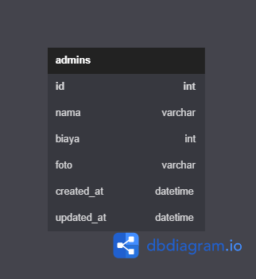

# API documentation ala ala

API endpoint yang disediain ada 4, yaitu :

| No. | Endpoint       | Method | Deskripsi                                                                                           |
| --- | -------------- | ------ | --------------------------------------------------------------------------------------------------- |
| 1   | /getCar        | GET    | Buat ngambil seluruh data mobil                                                                     |
| 2   | /postCar       | POST   | Buat nambah data baru mobil. Harus diisi dengan parameter body "nama,biaya,ukuran, dan file gambar" |
| 3   | /updateCar/:id | PUT    | Buat update data mobil. Semua parameter body harus diisi beserta id di query param                  |
| 4   | /deleteCar/:id | DELETE | Buat hapus data dengan id tertentu sesuai query params                                              |

## ERD

